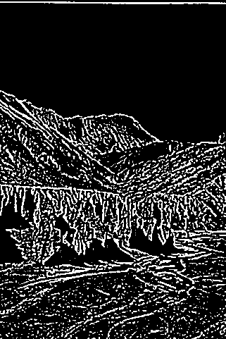

#TP2 Vision par ordinateur

##Detection de contours

On choisit d'utiliser les quatres detecteurs suivants:

* Sobel
* Scharr
* Laplace
* Canny

On va les experimenter sur une base de dix images.


###Sobel
L'implementation est definie comme suit:

````python
def SobelEdges(image):
    image = cv2.GaussianBlur(image,(9,9),0)
    edges = cv2.Sobel(img,cv2.CV_64F,1,1,ksize=5,scale=0.009)
    edges=edges.astype(np.uint8)
    ret, edges = cv2.threshold(edges, 10, 255, cv2.THRESH_BINARY)
    plt.subplot(1,3,1),plt.imshow(image,cmap = 'gray')
    plt.title('Original Image'), plt.xticks([]), plt.yticks([])
    plt.subplot(1,3,2),plt.imshow(edges,cmap = 'gray')
    plt.title('Edge Image'), plt.xticks([]), plt.yticks([])
    plt.subplot(1,3,3),plt.imshow(truth,cmap = 'gray')
    plt.title('Truth'), plt.xticks([]), plt.yticks([]) 
    print("sobel")     
    cv2.imwrite("./Images/sobel/"+str(count)+".png",edges)
````

Elle donne des resultats assez peu satisfaisant, les contours sont biens localisé mais avec de nombreux petit traits assez peu utilsables:


###Scharr
Scharr fonctionne sur le meme principe que sobel mais donnes des résultats plus satisfaisants:

````python
def ScharrEdges(image):
    image = cv2.GaussianBlur(image,(9,9),0)
    edges = cv2.Scharr(img,cv2.CV_64F,1,0,scale=0.004)+cv2.Scharr(img,cv2.CV_64F,0,1,scale=0.004)
    edges=edges.astype(np.uint8)
    ret, edges = cv2.threshold(edges, 10, 255, cv2.THRESH_BINARY)
    plt.subplot(1,3,1),plt.imshow(image,cmap = 'gray')
    plt.title('Original Image'), plt.xticks([]), plt.yticks([])
    plt.subplot(10,1,count),plt.imshow(edges,cmap = 'gray')
    plt.title('Edge Image'), plt.xticks([]), plt.yticks([])
    plt.subplot(1,3,3),plt.imshow(truth,cmap = 'gray')
    plt.title('Truth'), plt.xticks([]), plt.yticks([]) 
    print("scharr")
    CalculateData(edges,truth,3)
    cv2.imwrite("./Images/scharr/"+str(count)+".png",edges)
````


###Laplace
Laplace est beaucoup plus efficace, donnant des vrais contours, plus longs et plus definis:

````python
def LaplacianEdges(image):
    image = cv2.GaussianBlur(image,(5,5),0)
    edges = cv2.Laplacian(image,cv2.CV_64F,ksize=3,scale=0.05)
    edges=edges.astype(np.uint8)
    ret, edges = cv2.threshold(edges, 10, 255, cv2.THRESH_BINARY)
    plt.subplot(1,3,1),plt.imshow(image,cmap = 'gray')
    plt.title('Original Image'), plt.xticks([]), plt.yticks([])
    plt.subplot(1,3,2),plt.imshow(edges,cmap = 'gray')
    plt.title('Edge Image'), plt.xticks([]), plt.yticks([])
    plt.subplot(1,3,3),plt.imshow(truth,cmap = 'gray')
    plt.title('Truth'), plt.xticks([]), plt.yticks([]) 
    print("laplace")     
    CalculateData(edges,truth,1)
    cv2.imwrite("./Images/laplace/"+str(count)+".png",edges)
````

Les resultats sont très bons:


###Canny
Canny est un excellent detecteurs de contours. Ses résultats sont très bon.

````python
def cannyEdges(image):
    edges = cv2.Canny(image,210,230)
    ret, edges = cv2.threshold(edges, 10, 255, cv2.THRESH_BINARY)
    plt.subplot(1,3,1),plt.imshow(image,cmap = 'gray')
    plt.title('Original Image'), plt.xticks([]), plt.yticks([])
    plt.subplot(1,3,2),plt.imshow(edges,cmap = 'gray')
    plt.title('Edge Image'), plt.xticks([]), plt.yticks([])
    plt.subplot(1,3,3),plt.imshow(truth,cmap = 'gray')
    plt.title('Truth'), plt.xticks([]), plt.yticks([]) 
    print("canny")     
    CalculateData(edges,truth,0)
    cv2.imwrite("./Images/canny/"+str(count)+".png",edges)
````


On a des resultats excellents avec des tracés long et fin.


###Comparaison:

Pour une image:
######Sobel


######Scharr


######Laplace


######Canny


###Performance

On met en place une mesure de performance:

* P=contours-correc / (contours-correc+ faux-positifs ) 
* TFP = faux-positifs / (faux-positifs + vrai-negatifs)
* TFN = faux-negatifs / (contours-correc +faux-negatifs)

Implémenté dans python:

````python

def CalculateData(result,ref,index):
    global output

    dataArray=[cv2.countNonZero(result),cv2.countNonZero(ref),cv2.countNonZero(cv2.bitwise_and(result,ref)),cv2.countNonZero(cv2.bitwise_and(result,cv2.bitwise_not(ref))),cv2.countNonZero(cv2.bitwise_and(ref,cv2.bitwise_not(result))),cv2.countNonZero(cv2.bitwise_and(cv2.bitwise_not(result),cv2.bitwise_not(ref)))] 
    p=(dataArray[2]/float(dataArray[2]+dataArray[3]))
    print "P is %f" % p
    output[count-1][index*3+0]=p
    tfp=(dataArray[3]/float (dataArray[3]+dataArray[5]))
    print "TFP is %f" % tfp
    output[count-1][index*3+1]=tfp      
    tfn=(dataArray[4]/float (dataArray[2]+dataArray[4]))
    print "TFN is %f" % tfn
    output[count-1][index*3+2]=tfn  
````

Les données sont enregistrées dans un CSV.


On peut donc classer les methode, dans leur ordre d'efficacité:

* Canny (0.22)
* Scharr (0.18)
* Laplacian (0.17)
* Sobel (0.16)

Il reste que de plus, canny ne donne qu'un contours par tracé, ce qui est appréciable. 


Au final, le code est le suivant:

````python
import numpy as np
import csv
from matplotlib import pyplot as plt 
import cv2
import os
from os import listdir
from os.path import isfile, join
import sys
img=0
truth=0
mypath='./Images' 
count=1
output =  [[0 for x in range(12)] for x in range(10)] 


def loadImage(src): 
    global img
    img=cv2.imread(mypath+"/data/"+src ,1) 
    img.astype(np.uint8)
    img=cv2.cvtColor(img,cv2.COLOR_BGR2GRAY)
    cv2.imshow('image',img) 


def loadTruth(src): 
    global truth                                                                                                                                                                 
    truth=cv2.imread(mypath+"/truth/"+src ,1)
    truth.astype(np.uint8)
    truth=cv2.cvtColor(truth, cv2.COLOR_BGR2GRAY)
    ret, truth = cv2.threshold(truth, 10, 255, cv2.THRESH_BINARY)
    cv2.imshow('image',truth)


def analyzeImage(imgName):
    print imgName    
    loadImage (imgName)
    loadTruth(imgName)
    imgHeight=img.shape[0]
    imgWidth=img.shape[1]
    print "The image width is %d." % imgWidth
    print "The image height is %d." % imgHeight
    ScharrEdges(img)
    cannyEdges(img)
    LaplacianEdges(img)
    SobelEdges(img)

def cannyEdges(image):

    edges = cv2.Canny(image,150,180)
    ret, edges = cv2.threshold(edges, 10, 255, cv2.THRESH_BINARY)
    plt.subplot(1,3,1),plt.imshow(image,cmap = 'gray')
    plt.title('Original Image'), plt.xticks([]), plt.yticks([])
    plt.subplot(1,3,2),plt.imshow(edges,cmap = 'gray')
    plt.title('Edge Image'), plt.xticks([]), plt.yticks([])
    plt.subplot(1,3,3),plt.imshow(truth,cmap = 'gray')
    plt.title('Truth'), plt.xticks([]), plt.yticks([]) 
    print("canny")     
    CalculateData(edges,truth,0)
    cv2.imwrite("./Images/canny/"+str(count)+".png",edges)


def LaplacianEdges(image):
    image = cv2.GaussianBlur(image,(5,5),0)
    edges = cv2.Laplacian(image,cv2.CV_64F,ksize=3,scale=0.05)
    edges=edges.astype(np.uint8)
    ret, edges = cv2.threshold(edges, 10, 255, cv2.THRESH_BINARY)
    plt.subplot(1,3,1),plt.imshow(image,cmap = 'gray')
    plt.title('Original Image'), plt.xticks([]), plt.yticks([])
    plt.subplot(1,3,2),plt.imshow(edges,cmap = 'gray')
    plt.title('Edge Image'), plt.xticks([]), plt.yticks([])
    plt.subplot(1,3,3),plt.imshow(truth,cmap = 'gray')
    plt.title('Truth'), plt.xticks([]), plt.yticks([]) 
    print("laplace")     
    CalculateData(edges,truth,1)
    cv2.imwrite("./Images/laplace/"+str(count)+".png",edges)


def SobelEdges(image):
    image = cv2.GaussianBlur(image,(9,9),0)
    edges = cv2.Sobel(img,cv2.CV_64F,1,1,ksize=5,scale=0.009)
    edges=edges.astype(np.uint8)
    ret, edges = cv2.threshold(edges, 10, 255, cv2.THRESH_BINARY)
    plt.subplot(1,3,1),plt.imshow(image,cmap = 'gray')
    plt.title('Original Image'), plt.xticks([]), plt.yticks([])
    plt.subplot(1,3,2),plt.imshow(edges,cmap = 'gray')
    plt.title('Edge Image'), plt.xticks([]), plt.yticks([])
    plt.subplot(1,3,3),plt.imshow(truth,cmap = 'gray')
    plt.title('Truth'), plt.xticks([]), plt.yticks([]) 
    print("sobel")     
    CalculateData(edges,truth,2)
    cv2.imwrite("./Images/sobel/"+str(count)+".png",edges)

def ScharrEdges(image):
    image = cv2.GaussianBlur(image,(9,9),0)
    edges = cv2.Scharr(img,cv2.CV_64F,1,0,scale=0.004)+cv2.Scharr(img,cv2.CV_64F,0,1,scale=0.004)
    edges=edges.astype(np.uint8)
    ret, edges = cv2.threshold(edges, 10, 255, cv2.THRESH_BINARY)
    plt.subplot(1,3,1),plt.imshow(image,cmap = 'gray')
    plt.title('Original Image'), plt.xticks([]), plt.yticks([])
    plt.subplot(10,1,count),plt.imshow(edges,cmap = 'gray')
    plt.title('Edge Image'), plt.xticks([]), plt.yticks([])
    plt.subplot(1,3,3),plt.imshow(truth,cmap = 'gray')
    plt.title('Truth'), plt.xticks([]), plt.yticks([]) 
    print("scharr")
    CalculateData(edges,truth,3)
    cv2.imwrite("./Images/scharr/"+str(count)+".png",edges)


def CalculateData(result,ref,index):
    global output

    dataArray=[cv2.countNonZero(result),cv2.countNonZero(ref),cv2.countNonZero(cv2.bitwise_and(result,ref)),cv2.countNonZero(cv2.bitwise_and(result,cv2.bitwise_not(ref))),cv2.countNonZero(cv2.bitwise_and(ref,cv2.bitwise_not(result))),cv2.countNonZero(cv2.bitwise_and(cv2.bitwise_not(result),cv2.bitwise_not(ref)))] 
    p=(dataArray[2]/float(dataArray[2]+dataArray[3]))
    print "P is %f" % p
    output[count-1][index*3+0]=p
    tfp=(dataArray[3]/float (dataArray[3]+dataArray[5]))
    print "TFP is %f" % tfp
    output[count-1][index*3+1]=tfp      
    tfn=(dataArray[4]/float (dataArray[2]+dataArray[4]))
    print "TFN is %f" % tfn
    output[count-1][index*3+2]=tfn    


if __name__ =='__main__':
    global count
    onlyfiles = [f for f in listdir(mypath+"/data/") if isfile(join(mypath+"/data/", f))]
    for imagefile in onlyfiles :
        print os.path.splitext(imagefile)[1]
        if(os.path.splitext(imagefile)[1]== '.jpg' or os.path.splitext(imagefile)[0]== '.png'):
            analyzeImage(imagefile)
            count+=1
    print output
    with open('dataOutput.csv', 'w') as fp:
        a = csv.writer(fp, delimiter=',')
        for lines in output:
            a.writerow(lines)
   

````


##Fiabilité de la vérité terrain

On peut voir sur les [bases de l'eecs](http://www.eecs.berkeley.edu/Research/Projects/CS/vision/bsds/BSDS300/html/dataset/images/gray/78004.html) que la vérité terrain n'est pas absolue.

On observe des similitudes et des différences qui semblent avoir trait à des valeurs de threshold différents. Cependant, les valeurs à fort gradient se retrouvent systématiquement: ce sont les contours "sur".

Dans les programmes, on prend en compte ces différences en pondérant les notations de leur "popularité"

